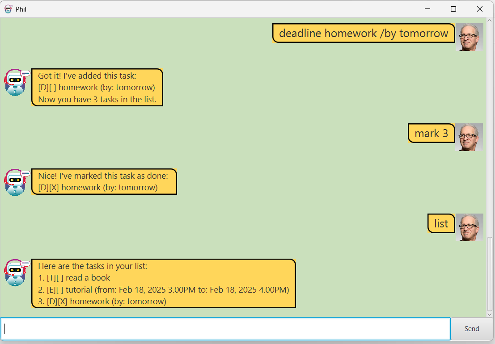

# Phil User Guide



Phil is a chatbot that helps you track your tasks and notes.

The user types a command into the input text-box

## Adding todo tasks

Add a Todo task that contains a description (with at least one word)
to the list of tasks.
Input format: `todo <description>`

Example Valid Input: `todo read`

```
Got it! I've added this task:
[T][ ] read
Now you have 5 tasks in the list.
```

Example Invalid Input: `todo`

```
Invalid arguments passed for creating tasks.
Details:
A Todo task requires a description of minimally one word.
For example, 'todo read' creates the task 'read'.
```

## Adding event tasks

Add an Event task that contains a description (with at least one word),
a "from" date (with at least one word) and a "to" date (with at least one word)
to the list of tasks.
Input format: `event <description> /from <start-date> /to <end-date>`

Note that the `<start-date>` and `<end-date>` specifically
accept dates in the format `MM/d/yyyy HHmm`. If your input matches this format,
the date will be displayed in the format `MMM d, yyyy h.mma`.

Example Valid Input: `event tutorial /from today afternoon /to tonight`

```
Got it! I've added this task:
[E][ ] tutorial (from: today afternoon to: tonight)
Now you have 5 tasks in the list.
```

Example Valid Input: `event tutorial /from 02/13/2025 1000 /to 02/13/2025 1100`

```
Got it! I've added this task:
[E][ ] tutorial (from: today afternoon to: tonight)
Now you have 5 tasks in the list.
```

Example Invalid Input: `event tutorial /from today`

```
Invalid arguments passed for creating tasks.
Details:
An Event task requires a description AND a from date, 
specified as a string after '/by'.
And a to date, specified as a string after '/to'.
For example, 'event reading /from Monday /to Tuesday' 
creates the event 'reading'\n from 'Monday' to 'Tuesday'.
```

## Adding deadline tasks

Add a Deadline task that contains a description (with at least one word),
a "by" date (with at least one word)
Input format: `event <description> /from <start-date> /to <end-date>`

Example Valid Input: `event tutorial /from today afternoon /to tonight`

```
Got it! I've added this task:
[E][ ] tutorial (from: today afternoon to: tonight)
Now you have 5 tasks in the list.
```

Example Invalid Input: `event tutorial /from today`

```
Invalid arguments passed for creating tasks.
Details:
An Event task requires a description AND a from date, 
specified as a string after '/by'.
And a to date, specified as a string after '/to'.
For example, 'event reading /from Monday /to Tuesday' 
creates the event 'reading'\n from 'Monday' to 'Tuesday'.
```
